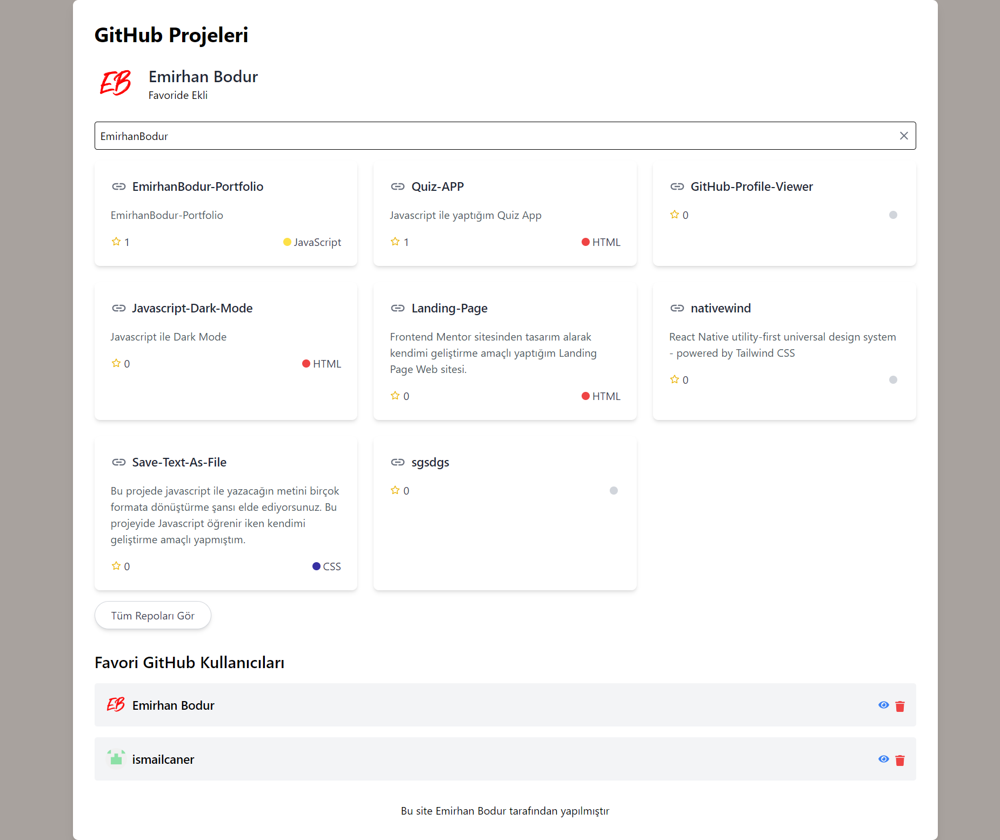

# GitHub-Profile-Viewer

Bu uygulama GitHub kullanıcılarının repolarını görüntülemek  ve favori kullanıcınızı Favoriler kısmına ekleyip takip etmek için kullanılır.

# Giriş

Bu projeyi yapma amacım, axios ve Tailwind CSS mantığını öğrenerek GitHub API ile etkileşimde bulunmak ve kullanıcının girdiği GitHub kullanıcı adına ait repo verilerini çekerek görüntülemektir. Kullanıcının seçtiği veya girdiği GitHub kullanıcısının projelerini listeleyerek, bu projelerin detaylarına erişim sağlamak ve kullanıcıya daha iyi bir deneyim sunmak hedeflenmiştir. Ayrıca, favori kullanıcıları takip edebilme özelliği eklenerek, kullanıcıların ilgi duydukları GitHub hesaplarını kolayca takip edebilmeleri amaçlanmıştır. Projede kullanılan teknolojiler arasında React, axios, Tailwind CSS ve diğer bileşenlerin kullanımıyla modern web geliştirme konularında deneyim kazanmak da amaçlanmaktadır. Bu sayede, hem bir API ile etkileşimde bulunma yetenekleri hem de bir React uygulamasının temel yapısını anlama konularında pratiğe sahip olmayı hedefliyorum.

